# Communication Workflow Documentation

## 🎯 Overview

This document details the complete communication workflow between NodeJS Synapse applications and the Home Assistant Synapse extension. The workflow uses WebSocket API for bidirectional communication and implements a hash-based synchronization system with comprehensive error handling and security features.

## 🔄 WebSocket Message ID Handling

### Message ID Flow and Response Expectations

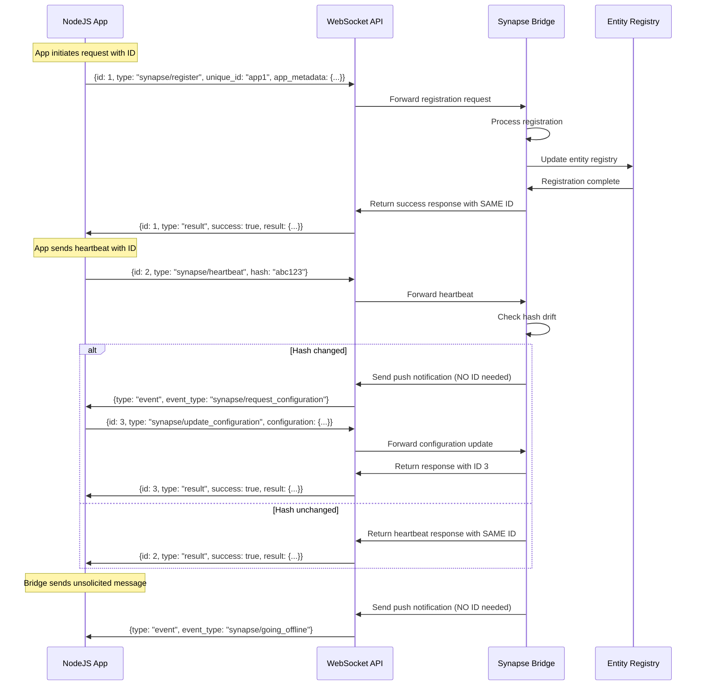

### Message ID Rules and Expectations

#### **Request-Response Pattern (App → Home Assistant)**
When the NodeJS app sends a message to Home Assistant:

1. **App assigns ID**: The app generates and assigns a unique integer ID to each outgoing message
2. **Home Assistant responds**: Home Assistant must respond with the **exact same ID** in the response
3. **ID correlation**: The app uses this ID to match responses to their original requests

```typescript
// App side - sending request
const messageId = this.nextMessageId();
const request = {
  id: messageId,
  type: "synapse/register",
  unique_id: "my_app",
  app_metadata: {...}
};
this.websocket.send(JSON.stringify(request));

// App side - handling response
this.websocket.onmessage = (event) => {
  const response = JSON.parse(event.data);
  if (response.id === messageId) {
    // This is the response to our request
    handleRegistrationResponse(response);
  }
};
```

#### **Push Notification Pattern (Home Assistant → App)**
When Home Assistant needs to send an unsolicited message to the app:

1. **No ID required**: Push notifications don't need IDs because they're not responses to requests
2. **Event format**: Use Home Assistant's event format for unsolicited messages
3. **App handles**: The app listens for these events and handles them appropriately

```python
# Bridge side - sending push notification
async def send_configuration_request(self, unique_id: str) -> bool:
    """Send configuration request to app (push notification)."""
    message = {
        "type": "event",
        "event_type": "synapse/request_configuration",
        "data": {
            "unique_id": unique_id,
            "reason": "hash_drift_detected"
        }
    }
    return await self.send_to_app(unique_id, message)
```

#### **Response Format Requirements**

**Successful Response:**
```json
{
  "id": 123,
  "type": "result",
  "success": true,
  "result": {
    "success": true,
    "registered": true,
    "message": "Registration successful"
  }
}
```

**Error Response:**
```json
{
  "id": 123,
  "type": "result",
  "success": false,
  "error": {
    "code": "already_connected",
    "message": "Unique ID already connected"
  }
}
```

**Push Notification:**
```json
{
  "type": "event",
  "event_type": "synapse/request_configuration",
  "data": {
    "unique_id": "app1",
    "reason": "hash_drift_detected"
  }
}
```

### Implementation Implications

#### **Current Issue with `_next_message_id()`**
The current implementation incorrectly tries to use `websocket_api.result_message(msg_id, message)` for push notifications from Home Assistant to the app. This is wrong because:

1. **`result_message` is for responses**: It's meant to respond to requests from the app
2. **Push notifications don't need IDs**: They're unsolicited messages, not responses
3. **Wrong direction**: The bridge shouldn't be generating IDs for messages to the app

#### **Correct Implementation**
```python
# WRONG - Don't do this for push notifications
async def send_to_app(self, unique_id: str, message: Dict[str, Any]) -> bool:
    msg_id = self._next_message_id()  # ❌ Not needed for push notifications
    connection.send_message(websocket_api.result_message(msg_id, message))  # ❌ Wrong format

# CORRECT - For push notifications
async def send_to_app(self, unique_id: str, message: Dict[str, Any]) -> bool:
    connection.send_message(websocket_api.event_message(message))  # ✅ Correct format
```

#### **Message Flow Summary**

| Direction | Message Type | ID Required | Format | Purpose |
|-----------|-------------|-------------|---------|---------|
| **App → HA** | Request | ✅ Yes | `{id: X, type: "command", ...}` | App sends command |
| **HA → App** | Response | ✅ Yes | `{id: X, type: "result", ...}` | HA responds to request |
| **HA → App** | Push Notification | ❌ No | `{type: "event", event_type: "...", data: {...}}` | HA sends unsolicited message |

### Error Handling for Message IDs

#### **Missing Response**
If the app doesn't receive a response with the expected ID within a timeout period:
```typescript
// App side timeout handling
const timeout = setTimeout(() => {
  console.error(`No response received for message ID ${messageId}`);
  // Handle timeout - retry, fail, etc.
}, 5000);
```

#### **Duplicate IDs**
The app should ensure unique IDs across all outgoing messages:
```typescript
class WebSocketClient {
  private messageIdCounter = 0;

  private nextMessageId(): number {
    return ++this.messageIdCounter;
  }
}
```

#### **Invalid Response Format**
Handle malformed responses gracefully:
```typescript
this.websocket.onmessage = (event) => {
  try {
    const response = JSON.parse(event.data);

    if (!response.id) {
      console.warn('Response missing ID:', response);
      return;
    }

    if (response.type === 'result') {
      this.handleResultResponse(response);
    } else if (response.type === 'event') {
      this.handleEventResponse(response);
    }
  } catch (error) {
    console.error('Failed to parse response:', error);
  }
};
```

## 🔄 Connection & Registration Flow

### Initial Connection Sequence

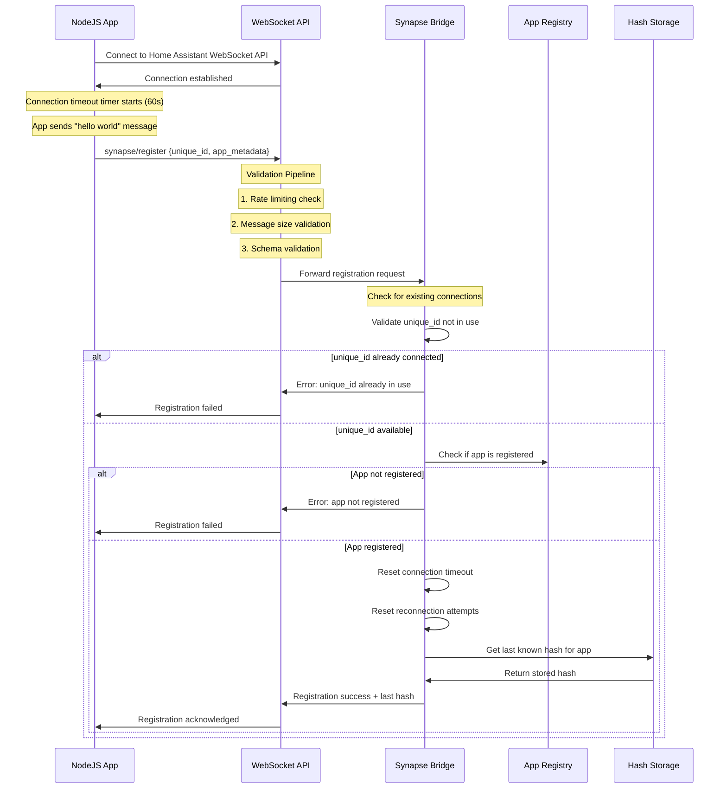

### App Metadata Structure

The "hello world" message contains the following metadata:

```typescript
interface AppMetadata {
  app: string;                    // Application name
  device: DeviceInfo;             // Primary device information
  hash: string;                   // Current configuration hash
  hostname: string;               // Host machine name
  secondary_devices: Device[];    // Additional devices
  title: string;                  // Human-readable title
  unique_id: string;              // Unique identifier
  username: string;               // System username
  // ... additional storage dump data
}
```

## 🔄 Hash Synchronization Flow

### Configuration Synchronization

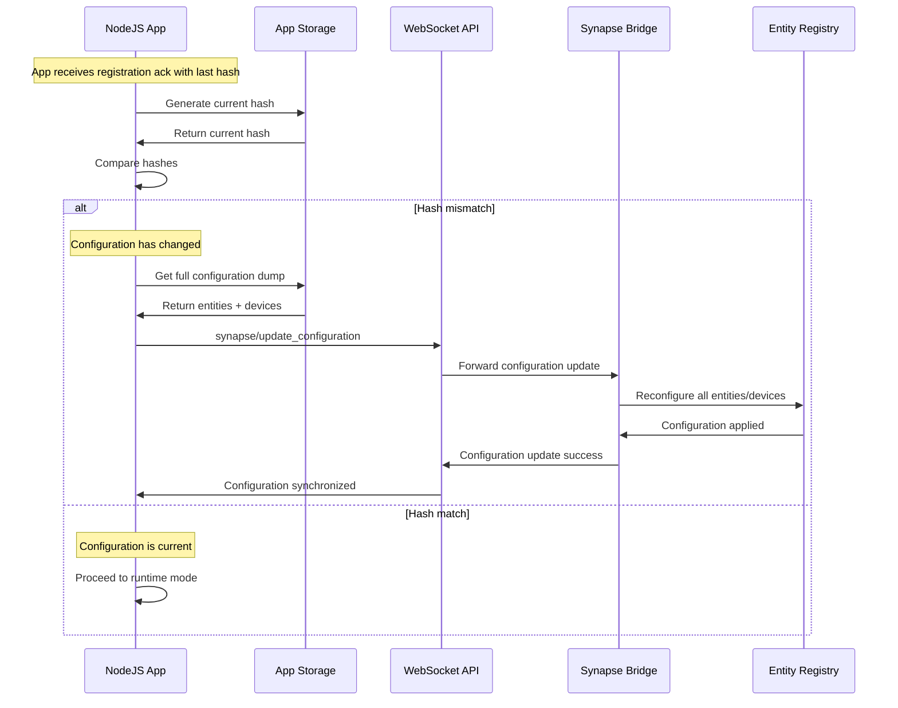

### Runtime State Management

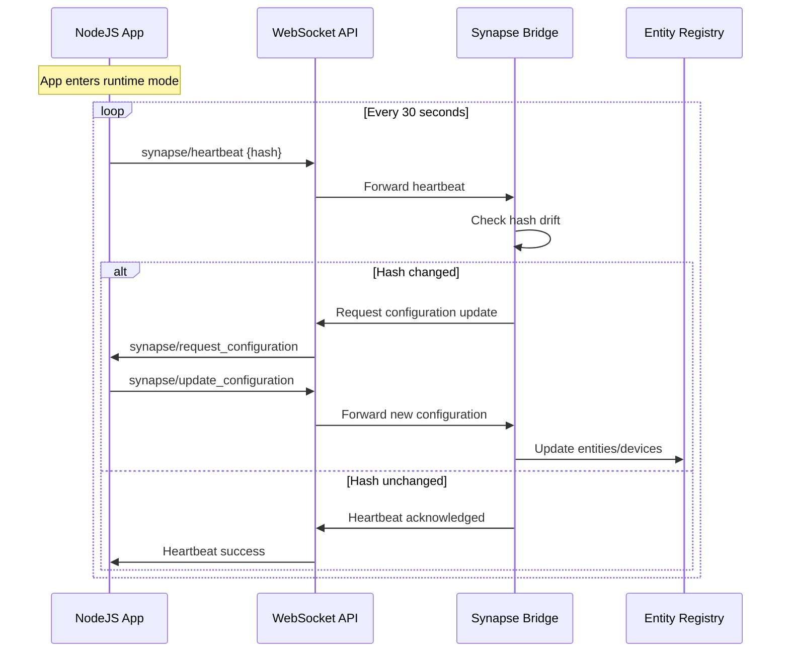

## 🔄 App Disconnection Flow

### Graceful Shutdown (SIGINT Handling)

When an app receives a SIGINT signal (Ctrl+C, process termination), it should perform a graceful shutdown:

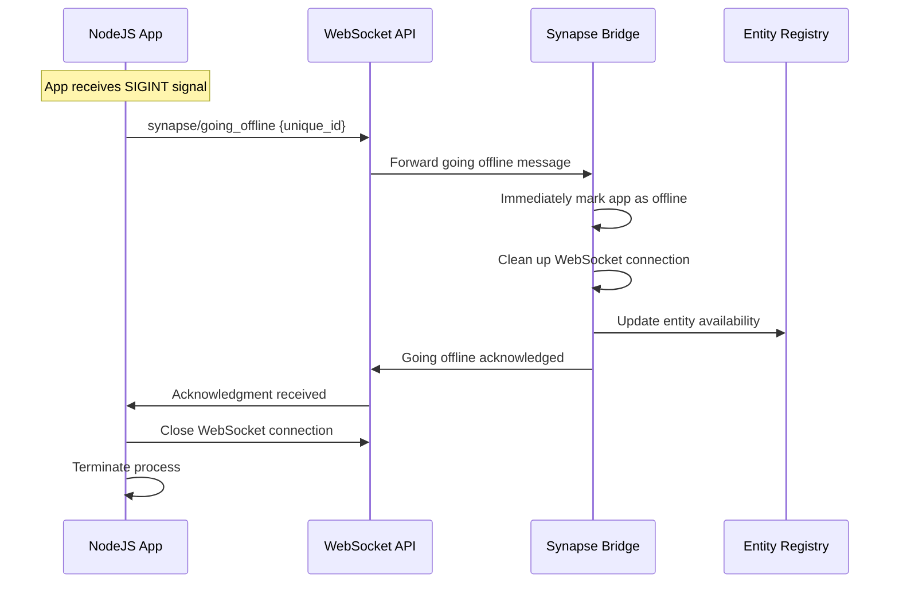

### Unexpected Disconnection (Timeout)

When an app suddenly stops (power loss, crash, network issues), the bridge detects this through heartbeat timeout:

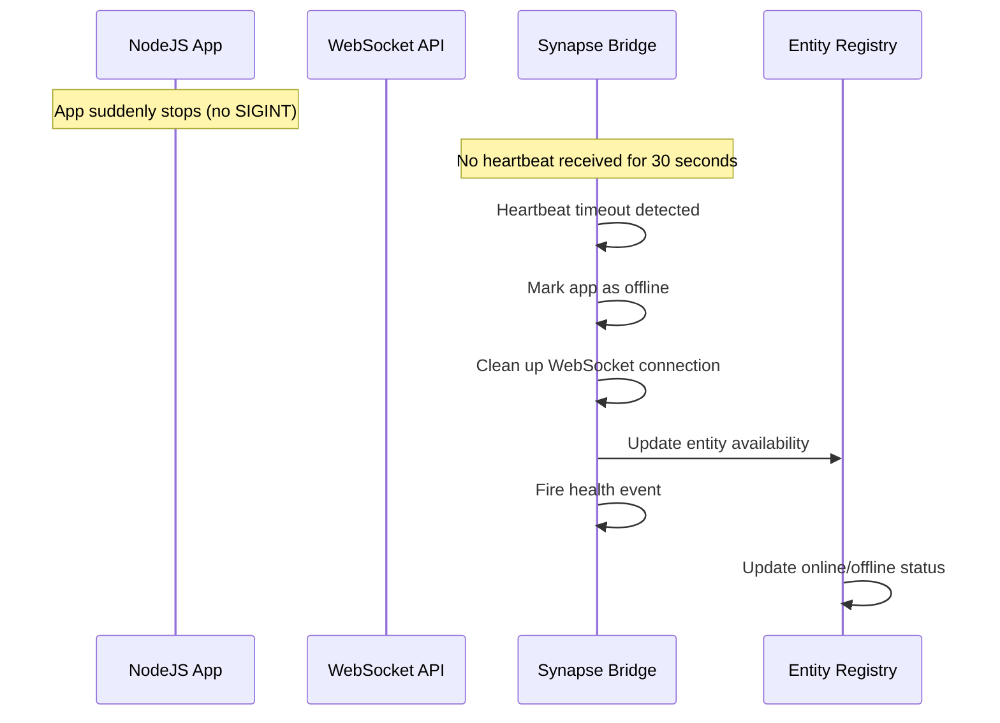

### Disconnection Handling Comparison

| Scenario | Signal | Bridge Response | Cleanup Actions |
|----------|--------|-----------------|-----------------|
| **Graceful Shutdown** | SIGINT | Immediate offline | Connection cleanup, entity availability update |
| **Unexpected Stop** | None (timeout) | 30-second delay | Connection cleanup, entity availability update |

### Implementation Notes

#### TypeScript Side (App)
```typescript
// Graceful shutdown handler
process.on('SIGINT', async () => {
  console.log('Received SIGINT, shutting down gracefully...');

  try {
    // Send going offline message
    await client.sendMessage('synapse/going_offline', {
      unique_id: appUniqueId
    });

    // Wait for acknowledgment
    await new Promise(resolve => setTimeout(resolve, 1000));

    // Close WebSocket connection
    client.disconnect();

    console.log('Graceful shutdown complete');
    process.exit(0);
  } catch (error) {
    console.error('Error during graceful shutdown:', error);
    process.exit(1);
  }
});
```

#### Python Side (Bridge)
```python
async def handle_going_offline(self, unique_id: str) -> Dict[str, Any]:
    """Handle graceful app shutdown."""
    self.logger.info(f"App {unique_id} going offline gracefully")

    # Immediately mark as offline
    self.online = False

    # Clean up WebSocket connection
    self.unregister_websocket_connection(unique_id)

    # Update entity availability
    self.hass.bus.async_fire(self.event_name("health"))

    return {
        "success": True,
        "offline": True,
        "message": "App marked as offline"
    }
```

## 🔄 Entity Update Flow

### Runtime Entity Patches

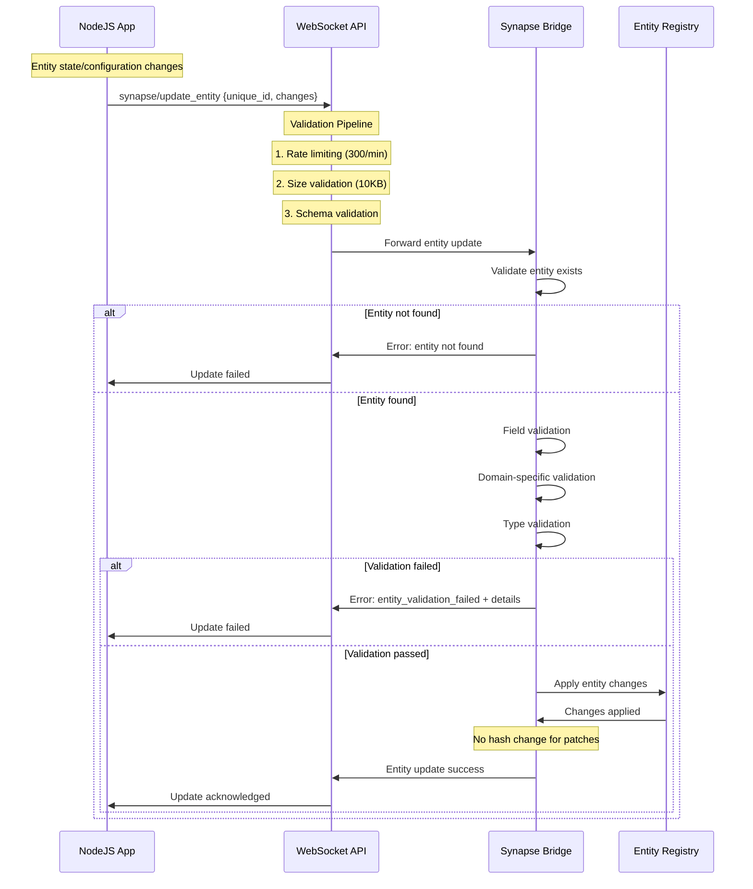

### Supported Entity Patch Types

The following entity updates are supported during runtime (no hash change):

1. **State Changes**
   - Sensor values
   - Switch states
   - Climate settings
   - Any entity state updates

2. **Visual Changes**
   - Icon updates
   - Name changes
   - Attribute modifications

3. **Configuration Changes**
   - Enable/disable entities
   - Related entity associations
   - Custom attributes

4. **Device Changes**
   - Device information updates
   - Device availability status

## 🚨 Error Handling & Recovery

### Enhanced Error Handling Features

The system now includes comprehensive error handling with the following features:

#### **Connection Timeout Management**
- **60-second connection timeout** for initial registration
- **Automatic cleanup** of stale connections
- **Connection health tracking** with uptime monitoring

#### **Automatic Reconnection**
- **Exponential backoff** reconnection strategy
- **Maximum 10 reconnection attempts** before giving up
- **Connection failure detection** and recovery mechanisms

#### **Rate Limiting**
- **Per-command rate limiting** to prevent abuse
- **Configurable limits** per command type
- **Automatic cleanup** of old rate limit tracking

#### **Message Validation**
- **Size limits** to prevent DoS attacks
- **Format validation** with detailed error messages
- **JSON serialization validation**

#### **Enhanced Entity Validation**
- **Domain-specific state validation**
- **Field type and length validation**
- **Attribute validation** with JSON serialization checks
- **Comprehensive error messages** with validation details

#### **Health Monitoring**
- **New `synapse/get_health` WebSocket command**
- **Connection uptime tracking**
- **Reconnection attempt monitoring**
- **Detailed health reporting**

### Connection Errors

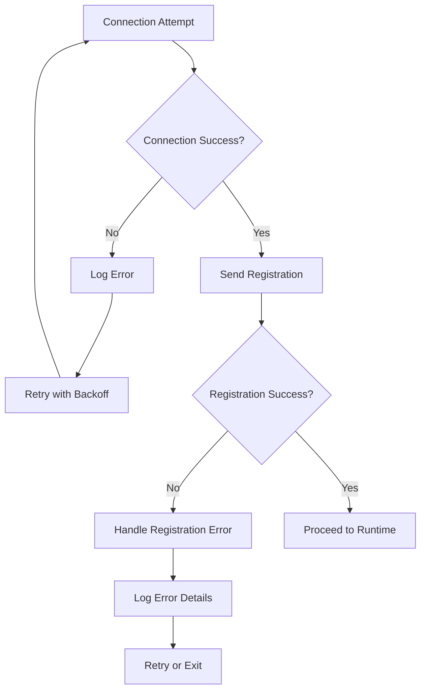

### Hash Drift Recovery

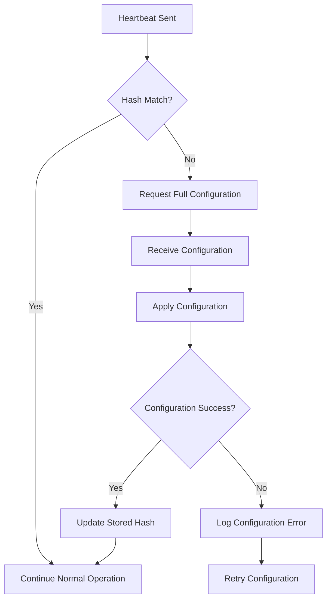

### Error Recovery Strategies

| Error Code | Recovery Strategy | Retry Logic |
|------------|-------------------|-------------|
| `bridge_not_found` | Wait and retry | Exponential backoff (2s, 4s, 8s...) |
| `rate_limit_exceeded` | Wait and retry | Exponential backoff (1s, 2s, 4s...) |
| `message_too_large` | Reduce message size | Immediate retry with smaller message |
| `entity_validation_failed` | Fix validation errors | Immediate retry after fixing errors |
| `not_registered` | Configure app | No retry - configuration error |
| `connection_timeout` | Reconnect | Exponential backoff |
| `reconnection_failed` | Manual intervention | No automatic retry |

### Security & Rate Limiting

#### **Rate Limiting Configuration**
- **Registration**: 10 requests per minute
- **Heartbeat**: 120 requests per minute (2 per second)
- **Entity Updates**: 300 requests per minute (5 per second)
- **Configuration Updates**: 5 requests per minute
- **Going Offline**: 10 requests per minute
- **Health Check**: 120 requests per minute

#### **Message Size Limits**
- **Registration**: 50KB
- **Entity Updates**: 10KB
- **Configuration Updates**: 1MB
- **Heartbeat**: 1KB
- **Health Check**: 1KB

#### **Connection Timeout Settings**
- **Connection Timeout**: 60 seconds for initial registration
- **Heartbeat Timeout**: 30 seconds for heartbeat monitoring
- **Reconnect Delay**: 5 seconds base delay
- **Max Reconnect Attempts**: 10 attempts

## 🔧 Future Enhancements

### Multiple Connection Support (Planned)

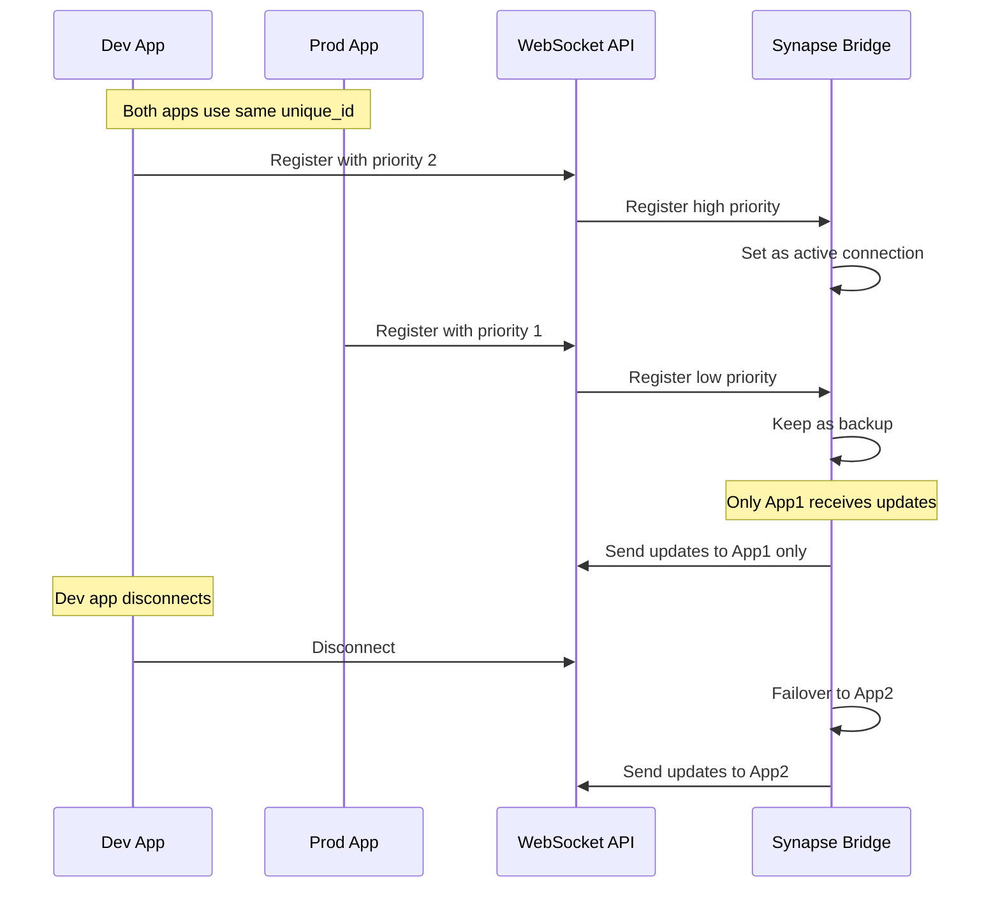

### Dynamic Service Creation (Planned)

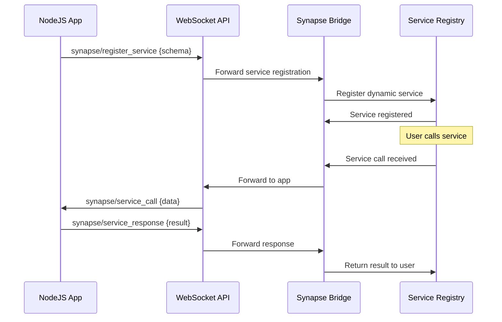

## 📋 Implementation Notes

### WebSocket Commands

| Command | Direction | Purpose | Payload | Rate Limit |
|---------|-----------|---------|---------|------------|
| `synapse/register` | App → HA | Initial registration | App metadata | 10/min |
| `synapse/heartbeat` | App → HA | Health check | Current hash | 120/min |
| `synapse/update_entity` | App → HA | Entity updates | Entity changes | 300/min |
| `synapse/update_configuration` | App → HA | Full config sync | Complete config | 5/min |
| `synapse/request_configuration` | HA → App | Request config | None | N/A |
| `synapse/going_offline` | App → HA | Graceful shutdown | Unique ID | 10/min |
| `synapse/get_health` | App → HA | Health check | Optional unique_id | 120/min |
| `synapse/register_service` | App → HA | Service registration | Service schema | 5/min |
| `synapse/service_call` | HA → App | Service invocation | Service data | N/A |
| `synapse/service_response` | App → HA | Service response | Service result | 300/min |

### Hash Generation

The hash is generated from the complete application configuration:

```typescript
// Simplified hash generation
function generateHash(config: AppConfiguration): string {
  const normalized = normalizeConfiguration(config);
  return createHash('sha256')
    .update(JSON.stringify(normalized))
    .digest('hex');
}
```

### Connection Management

- **Unique ID Validation**: Prevents multiple active connections with same ID
- **Priority System**: Future enhancement for dev/prod workflows
- **Graceful Disconnect**: Clean up resources when apps disconnect
- **Reconnection**: Apps can reconnect and resume operation
- **Connection Timeouts**: Automatic cleanup of stale connections
- **Health Monitoring**: Real-time connection health tracking

### Error Recovery

- **Connection Loss**: Automatic reconnection with exponential backoff
- **Hash Drift**: Request full configuration resync
- **Invalid Data**: Log errors and continue operation
- **Service Failures**: Retry with appropriate error handling
- **Rate Limiting**: Respect limits and implement backoff
- **Validation Errors**: Detailed error messages for debugging

## 🎯 Success Criteria

### Connection & Registration
- ✅ Apps can connect and register successfully
- ✅ Duplicate unique_id connections are rejected
- ✅ Unregistered apps are rejected
- ✅ Hash synchronization works correctly
- ✅ Connection timeouts are handled properly
- ✅ Rate limiting prevents abuse

### Runtime Operation
- ✅ Heartbeats maintain connection health
- ✅ Hash drift detection triggers resync
- ✅ Entity updates are applied correctly
- ✅ No hash changes for runtime patches
- ✅ Health monitoring provides detailed status
- ✅ Automatic reconnection works reliably

### Error Handling
- ✅ Connection failures are handled gracefully
- ✅ Invalid data doesn't crash the system
- ✅ Recovery mechanisms work correctly
- ✅ Comprehensive error logging
- ✅ Rate limiting prevents abuse
- ✅ Message validation catches errors early

### Future Enhancements
- ✅ Multiple connection support (planned)
- ✅ Dynamic service creation (planned)
- ✅ External device attachment (planned)
- ✅ WebSocket-based discovery (planned)

---

**Last Updated**: [Current Date]
**Status**: Documentation Complete with Enhanced Error Handling
**Next Review**: After WebSocket Implementation
