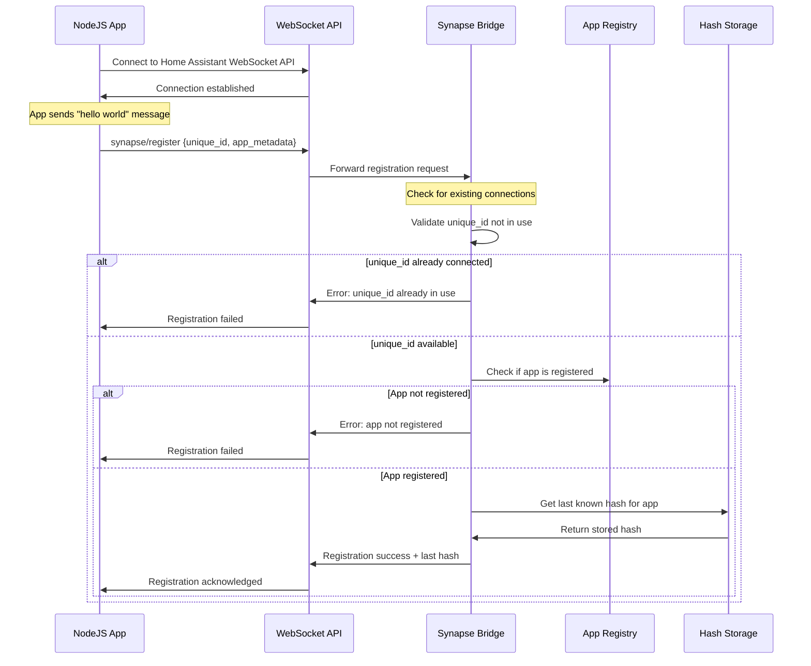
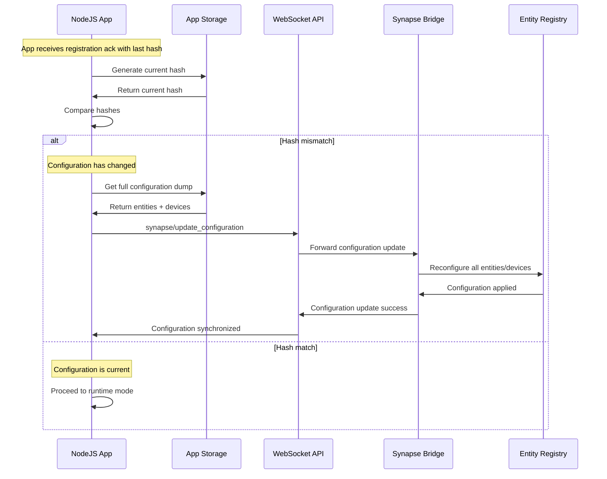
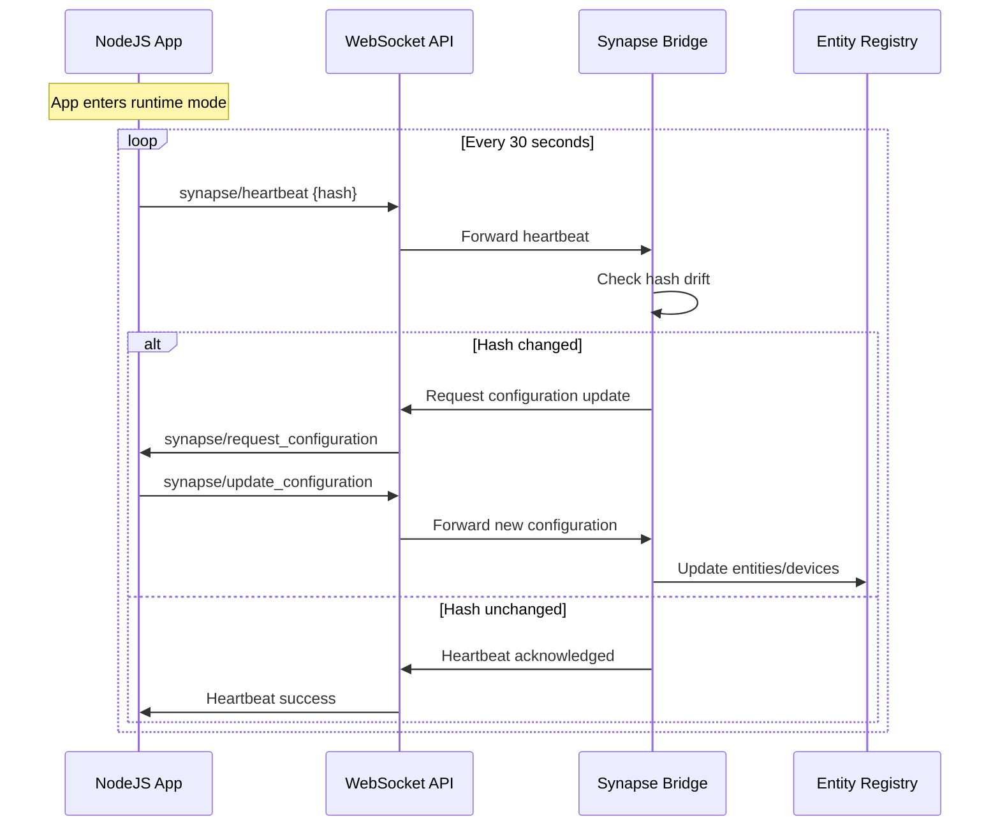
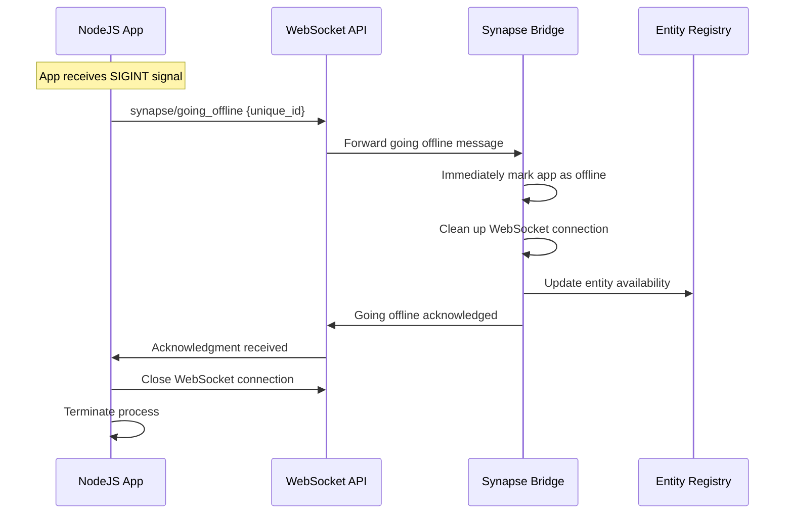
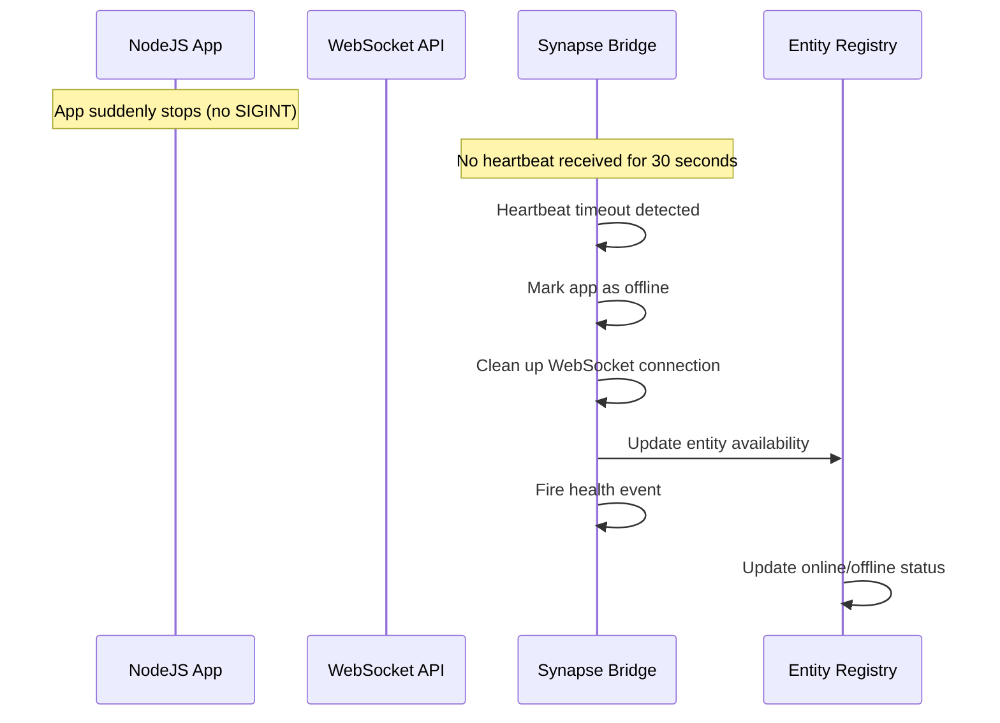
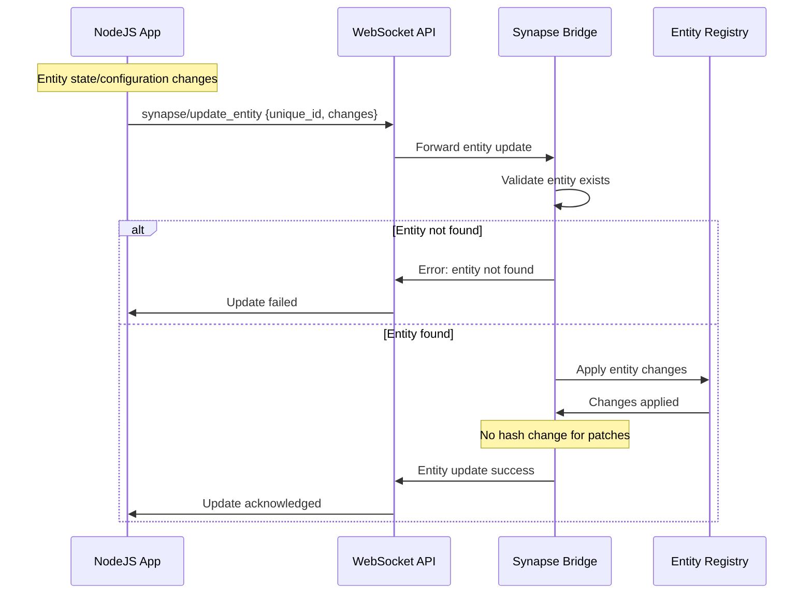
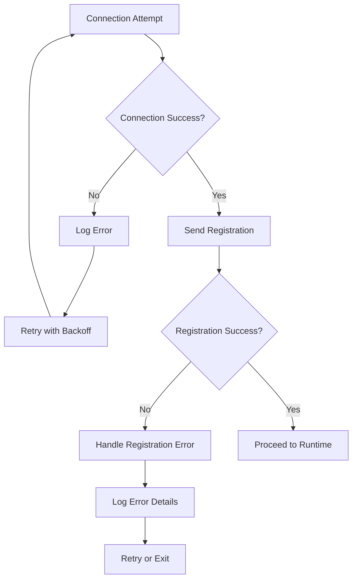
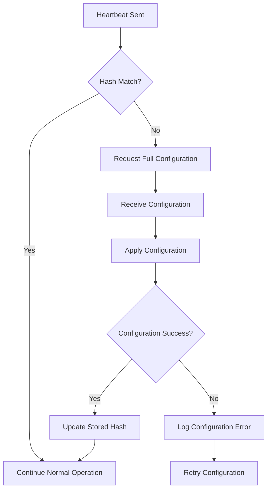
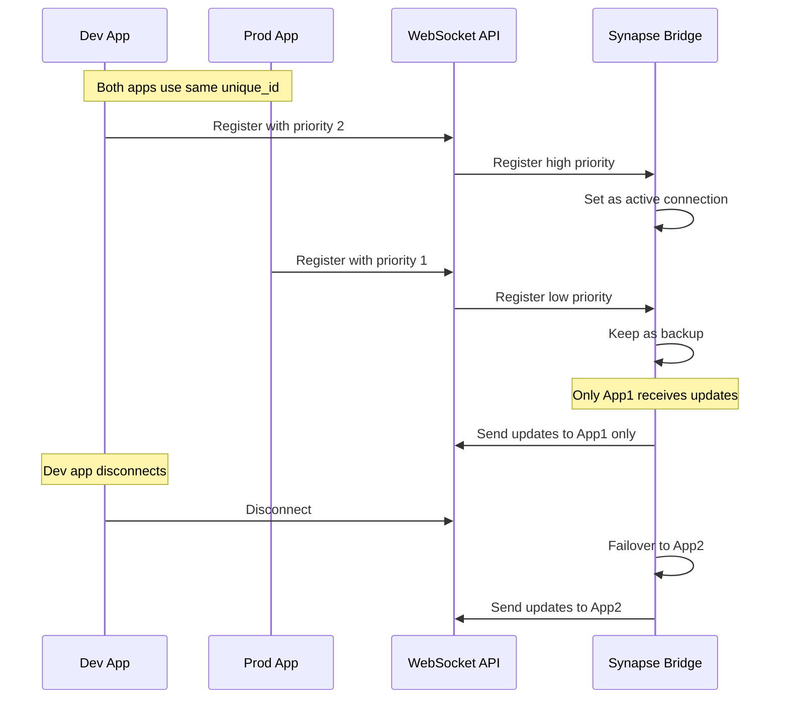
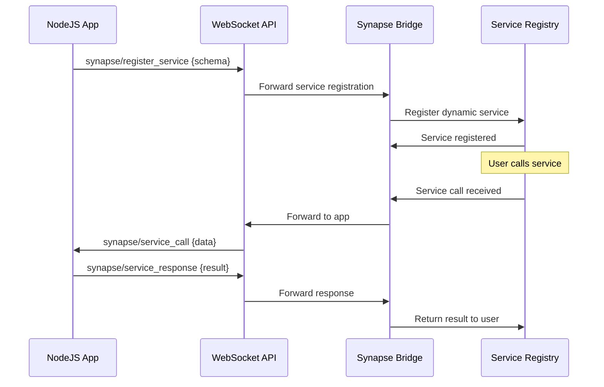

# Communication Workflow Documentation

## 🎯 Overview

This document details the complete communication workflow between NodeJS Synapse applications and the Home Assistant Synapse extension. The workflow uses WebSocket API for bidirectional communication and implements a hash-based synchronization system.

## 🔄 Connection & Registration Flow

### Initial Connection Sequence



### App Metadata Structure

The "hello world" message contains the following metadata:

```typescript
interface AppMetadata {
  app: string;                    // Application name
  device: DeviceInfo;             // Primary device information
  hash: string;                   // Current configuration hash
  hostname: string;               // Host machine name
  secondary_devices: Device[];    // Additional devices
  title: string;                  // Human-readable title
  unique_id: string;              // Unique identifier
  username: string;               // System username
  // ... additional storage dump data
}
```

## 🔄 Hash Synchronization Flow

### Configuration Synchronization



### Runtime State Management



## 🔄 App Disconnection Flow

### Graceful Shutdown (SIGINT Handling)

When an app receives a SIGINT signal (Ctrl+C, process termination), it should perform a graceful shutdown:



### Unexpected Disconnection (Timeout)

When an app suddenly stops (power loss, crash, network issues), the bridge detects this through heartbeat timeout:



### Disconnection Handling Comparison

| Scenario | Signal | Bridge Response | Cleanup Actions |
|----------|--------|-----------------|-----------------|
| **Graceful Shutdown** | SIGINT | Immediate offline | Connection cleanup, entity availability update |
| **Unexpected Stop** | None (timeout) | 30-second delay | Connection cleanup, entity availability update |

### Implementation Notes

#### TypeScript Side (App)
```typescript
// Graceful shutdown handler
process.on('SIGINT', async () => {
  console.log('Received SIGINT, shutting down gracefully...');

  try {
    // Send going offline message
    await client.sendMessage('synapse/going_offline', {
      unique_id: appUniqueId
    });

    // Wait for acknowledgment
    await new Promise(resolve => setTimeout(resolve, 1000));

    // Close WebSocket connection
    client.disconnect();

    console.log('Graceful shutdown complete');
    process.exit(0);
  } catch (error) {
    console.error('Error during graceful shutdown:', error);
    process.exit(1);
  }
});
```

#### Python Side (Bridge)
```python
async def handle_going_offline(self, unique_id: str) -> Dict[str, Any]:
    """Handle graceful app shutdown."""
    self.logger.info(f"App {unique_id} going offline gracefully")

    # Immediately mark as offline
    self.online = False

    # Clean up WebSocket connection
    self.unregister_websocket_connection(unique_id)

    # Update entity availability
    self.hass.bus.async_fire(self.event_name("health"))

    return {
        "success": True,
        "offline": True,
        "message": "App marked as offline"
    }
```

## 🔄 Entity Update Flow

### Runtime Entity Patches



### Supported Entity Patch Types

The following entity updates are supported during runtime (no hash change):

1. **State Changes**
   - Sensor values
   - Switch states
   - Climate settings
   - Any entity state updates

2. **Visual Changes**
   - Icon updates
   - Name changes
   - Attribute modifications

3. **Configuration Changes**
   - Enable/disable entities
   - Related entity associations
   - Custom attributes

4. **Device Changes**
   - Device information updates
   - Device availability status

## 🚨 Error Handling

### Connection Errors



### Hash Drift Recovery



## 🔧 Future Enhancements

### Multiple Connection Support (Planned)



### Dynamic Service Creation (Planned)



## 📋 Implementation Notes

### WebSocket Commands

| Command | Direction | Purpose | Payload |
|---------|-----------|---------|---------|
| `synapse/register` | App → HA | Initial registration | App metadata |
| `synapse/heartbeat` | App → HA | Health check | Current hash |
| `synapse/update_entity` | App → HA | Entity updates | Entity changes |
| `synapse/update_configuration` | App → HA | Full config sync | Complete config |
| `synapse/request_configuration` | HA → App | Request config | None |
| `synapse/going_offline` | App → HA | Graceful shutdown | Unique ID |
| `synapse/register_service` | App → HA | Service registration | Service schema |
| `synapse/service_call` | HA → App | Service invocation | Service data |
| `synapse/service_response` | App → HA | Service response | Service result |

### Hash Generation

The hash is generated from the complete application configuration:

```typescript
// Simplified hash generation
function generateHash(config: AppConfiguration): string {
  const normalized = normalizeConfiguration(config);
  return createHash('sha256')
    .update(JSON.stringify(normalized))
    .digest('hex');
}
```

### Connection Management

- **Unique ID Validation**: Prevents multiple active connections with same ID
- **Priority System**: Future enhancement for dev/prod workflows
- **Graceful Disconnect**: Clean up resources when apps disconnect
- **Reconnection**: Apps can reconnect and resume operation

### Error Recovery

- **Connection Loss**: Automatic reconnection with exponential backoff
- **Hash Drift**: Request full configuration resync
- **Invalid Data**: Log errors and continue operation
- **Service Failures**: Retry with appropriate error handling

## 🎯 Success Criteria

### Connection & Registration
- ✅ Apps can connect and register successfully
- ✅ Duplicate unique_id connections are rejected
- ✅ Unregistered apps are rejected
- ✅ Hash synchronization works correctly

### Runtime Operation
- ✅ Heartbeats maintain connection health
- ✅ Hash drift detection triggers resync
- ✅ Entity updates are applied correctly
- ✅ No hash changes for runtime patches

### Error Handling
- ✅ Connection failures are handled gracefully
- ✅ Invalid data doesn't crash the system
- ✅ Recovery mechanisms work correctly
- ✅ Comprehensive error logging

### Future Enhancements
- ✅ Multiple connection support (planned)
- ✅ Dynamic service creation (planned)
- ✅ External device attachment (planned)
- ✅ WebSocket-based discovery (planned)

---

**Last Updated**: [Current Date]
**Status**: Documentation Complete
**Next Review**: After WebSocket Implementation
