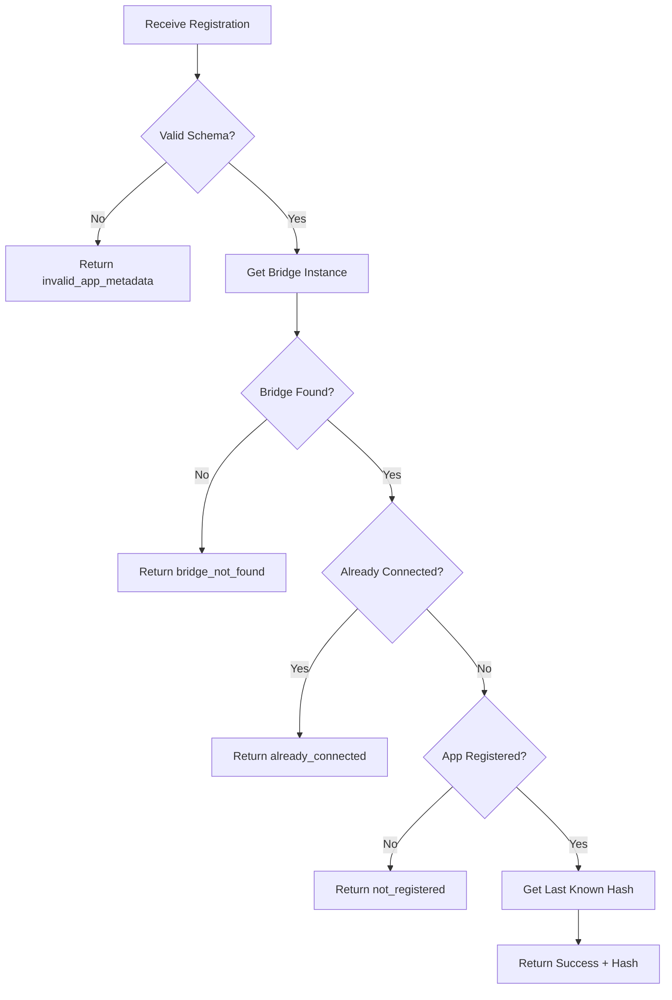

# WebSocket Error Codes & Validation Logic

## 🎯 Overview

This document details the error codes and validation logic used in the Synapse WebSocket communication system. All error responses include both human-readable messages and machine-readable error codes for proper error handling.

## 📋 Error Code Reference

### Registration Errors

| Error Code | Description | HTTP Status | When It Occurs |
|------------|-------------|-------------|----------------|
| `already_connected` | Unique ID is already connected | 409 Conflict | App tries to register with a unique_id that already has an active WebSocket connection |
| `not_registered` | App is not registered in config | 403 Forbidden | App tries to register but its unique_id is not found in any config entry |
| `bridge_not_found` | No bridge found for unique_id | 404 Not Found | WebSocket handler cannot find a bridge instance for the given unique_id |

### Communication Errors

| Error Code | Description | HTTP Status | When It Occurs |
|------------|-------------|-------------|----------------|
| `registration_failed` | Registration process failed | 500 Internal Server Error | Unexpected error during registration validation |
| `heartbeat_failed` | Heartbeat processing failed | 500 Internal Server Error | Unexpected error during heartbeat processing |
| `update_failed` | Entity update failed | 500 Internal Server Error | Unexpected error during entity update |
| `configuration_update_failed` | Configuration update failed | 500 Internal Server Error | Unexpected error during configuration update |

### Validation Errors

| Error Code | Description | HTTP Status | When It Occurs |
|------------|-------------|-------------|----------------|
| `invalid_unique_id` | Invalid unique_id format | 400 Bad Request | unique_id is missing, empty, or malformed |
| `invalid_app_metadata` | Invalid app metadata | 400 Bad Request | App metadata is missing required fields or malformed |
| `invalid_hash` | Invalid hash format | 400 Bad Request | Hash is missing, empty, or malformed |

### System Errors

| Error Code | Description | HTTP Status | When It Occurs |
|------------|-------------|-------------|----------------|
| `internal_error` | Internal server error | 500 Internal Server Error | Unexpected system error |
| `timeout_error` | Operation timed out | 408 Request Timeout | Operation exceeded timeout limit |
| `connection_error` | Connection error | 503 Service Unavailable | WebSocket connection issues |

## 🔄 Validation Logic Flow

### Registration Validation Process



### Validation Methods

#### 1. `is_unique_id_connected(unique_id: str) -> bool`
```python
def is_unique_id_connected(self, unique_id: str) -> bool:
    """Check if a unique_id already has an active WebSocket connection."""
    return unique_id in self._websocket_connections
```

**Purpose**: Prevents multiple apps from using the same `unique_id` simultaneously.

**Logic**:
- Check if `unique_id` exists as a key in `self._websocket_connections`
- Return `True` if already connected, `False` otherwise

#### 2. `is_app_registered(unique_id: str) -> bool`
```python
def is_app_registered(self, unique_id: str) -> bool:
    """Check if the unique_id corresponds to a registered app in config."""
    config_entries = self.hass.config_entries.async_entries(DOMAIN)

    for entry in config_entries:
        if entry.data.get("unique_id") == unique_id:
            return True

    return False
```

**Purpose**: Ensures only properly configured apps can connect.

**Logic**:
- Get all config entries for the `synapse` domain
- Check each entry's `unique_id` field
- Return `True` if match found, `False` otherwise

#### 3. `get_last_known_hash(unique_id: str) -> str`
```python
def get_last_known_hash(self, unique_id: str) -> str:
    """Get the last known hash for this app."""
    return self._hash_dict.get(unique_id, "")
```

**Purpose**: Provides hash for configuration comparison.

**Logic**:
- Look in `self._hash_dict` for the `unique_id`
- Return stored hash or empty string if not found

## 🤔 Understanding Bridge Not Found

### Why Does `bridge_not_found` Exist?

The `bridge_not_found` error exists primarily to handle **race conditions** and **timing issues** during system startup. While it may seem similar to `not_registered`, they serve different purposes:

#### `not_registered` vs `bridge_not_found`

| Error | When It Occurs | Why It Happens | User Action |
|-------|----------------|----------------|-------------|
| `not_registered` | App's unique_id not in config entries | App was never configured or config was removed | Configure the app in Home Assistant |
| `bridge_not_found` | Config entry exists but bridge instance not available | Race condition during startup or bridge cleanup | Wait and retry (app should handle automatically) |

### When Does `bridge_not_found` Occur?

#### 1. **Race Condition During Startup (Most Common)**
- **Timeline**: App starts immediately → tries to connect → bridge still initializing
- **Why**: Apps often start faster than Home Assistant bridge initialization
- **Window**: 2-3 seconds where config exists but bridge isn't ready
- **Solution**: App should retry automatically with exponential backoff

#### 2. **Bridge Cleanup During Operation**
- **Timeline**: App connected → user removes integration → app continues sending messages
- **Why**: Bridge gets removed from memory but app doesn't know
- **Window**: Brief period until app detects disconnection
- **Solution**: App should reconnect when bridge becomes available again

#### 3. **Bridge Initialization Failure**
- **Timeline**: Config entry exists → bridge creation fails → app tries to connect
- **Why**: Bridge failed to initialize due to missing dependencies or errors
- **Window**: Indefinite until config entry is fixed
- **Solution**: Fix the underlying issue causing bridge initialization failure

### The Race Condition Explained

```python
# Timeline of events during startup:
T=0: App starts up and immediately tries to connect
T=1: WebSocket handler looks for bridge - NOT FOUND
T=2: WebSocket returns bridge_not_found error
T=3: Home Assistant finishes loading config entries
T=4: Bridge initialization begins
T=5: Bridge becomes available in hass.data[DOMAIN]
```

The race condition happens because:
- **Apps are eager to connect** (start immediately on boot)
- **Bridge initialization takes time** (depends on Home Assistant startup)
- **Config entries load before bridges** (config exists but bridge doesn't)

### Why Not Just Use `not_registered`?

While `bridge_not_found` and `not_registered` might seem similar, they represent different scenarios:

- **`not_registered`**: "You're not supposed to connect" (business logic error)
- **`bridge_not_found`**: "You should be able to connect, but timing/system issue" (technical error)

This distinction allows apps to implement different handling:
- **`not_registered`**: Don't retry, show configuration error
- **`bridge_not_found`**: Retry with backoff, wait for system to be ready

### Best Practices for Handling `bridge_not_found`

#### For App Developers:
```typescript
if (error.error_code === "bridge_not_found") {
  // This is likely a race condition - retry with backoff
  await sleep(2000);
  return retryConnection();
} else if (error.error_code === "not_registered") {
  // This is a configuration error - don't retry
  throw new Error("App not configured in Home Assistant");
}
```

#### For End Users:
- **No action required** - apps should handle `bridge_not_found` automatically
- **If persistent**: Check Home Assistant logs for bridge initialization errors
- **If frequent**: Consider delaying app startup by a few seconds

## 📝 Response Format

### Success Response
```json
{
  "success": true,
  "registered": true,
  "last_known_hash": "abc123...",
  "message": "Registration successful",
  "unique_id": "my_app_123"
}
```

### Error Response
```json
{
  "success": false,
  "error_code": "already_connected",
  "message": "Unique ID my_app_123 is already connected",
  "unique_id": "my_app_123"
}
```

### WebSocket Error Response
```json
{
  "id": 1,
  "type": "result",
  "success": false,
  "error": {
    "code": "already_connected",
    "message": "Unique ID my_app_123 is already connected"
  }
}
```

## 🚨 Error Handling Scenarios

### Scenario 1: Duplicate Connection Attempt
```json
// App tries to register with unique_id that's already connected
{
  "id": 1,
  "type": "synapse/register",
  "unique_id": "my_app_123",
  "app_metadata": {...}
}

// Response
{
  "id": 1,
  "type": "result",
  "success": false,
  "error_code": "already_connected",
  "message": "Unique ID my_app_123 is already connected",
  "unique_id": "my_app_123"
}
```

### Scenario 2: Unregistered App
```json
// App tries to register but isn't in config
{
  "id": 2,
  "type": "synapse/register",
  "unique_id": "unknown_app",
  "app_metadata": {...}
}

// Response
{
  "id": 2,
  "type": "result",
  "success": false,
  "error_code": "not_registered",
  "message": "App with unique_id unknown_app is not registered",
  "unique_id": "unknown_app"
}
```

### Scenario 3: Bridge Not Found (Race Condition)
```json
// App tries to register during startup race condition
{
  "id": 3,
  "type": "synapse/register",
  "unique_id": "my_app_123",
  "app_metadata": {...}
}

// Response
{
  "id": 3,
  "type": "result",
  "success": false,
  "error_code": "bridge_not_found",
  "message": "Bridge not found for unique_id my_app_123 - may still be initializing",
  "unique_id": "my_app_123"
}
```

### Scenario 4: Successful Registration
```json
// Valid registration
{
  "id": 4,
  "type": "synapse/register",
  "unique_id": "my_app_123",
  "app_metadata": {...}
}

// Response
{
  "id": 4,
  "type": "result",
  "success": true,
  "registered": true,
  "last_known_hash": "abc123def456...",
  "message": "Registration successful",
  "unique_id": "my_app_123"
}
```

## 🔧 Implementation Notes

### Error Code Usage
- **Consistent Format**: All error responses include `error_code` and `message`
- **Machine Readable**: Error codes are strings for easy parsing
- **Human Readable**: Messages provide context for debugging
- **Unique IDs**: All responses include the `unique_id` for correlation

### Validation Order
1. **Schema Validation**: Check message format and required fields
2. **Bridge Lookup**: Find bridge instance for the unique_id
3. **Connection Check**: Verify unique_id isn't already connected
4. **Registration Check**: Verify app is registered in config
5. **Hash Retrieval**: Get last known hash for comparison

### Logging
- **Info Level**: Successful registrations
- **Warning Level**: Validation failures (already connected, not registered)
- **Error Level**: Unexpected errors during processing
- **Debug Level**: Detailed processing information

### Security Considerations
- **Unique ID Validation**: Prevents connection hijacking
- **Config Validation**: Ensures only authorized apps connect
- **Connection Tracking**: Maintains connection state integrity
- **Error Information**: Provides enough detail for debugging without exposing internals

## 🎯 Best Practices

### For App Developers
1. **Handle All Error Codes**: Implement proper error handling for all possible error codes
2. **Retry Logic**: Implement exponential backoff for transient errors (especially `bridge_not_found`)
3. **Logging**: Log error codes and messages for debugging
4. **User Feedback**: Provide meaningful user feedback based on error codes

### For Integration Developers
1. **Consistent Error Codes**: Use predefined error codes from `SynapseErrorCodes`
2. **Detailed Logging**: Log validation failures with context
3. **Graceful Degradation**: Handle unexpected errors gracefully
4. **Security**: Don't expose sensitive information in error messages

---

**Last Updated**: [Current Date]
**Status**: Implementation Complete
**Next Review**: After testing with real applications
